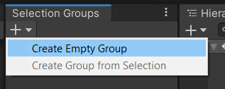
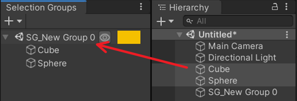
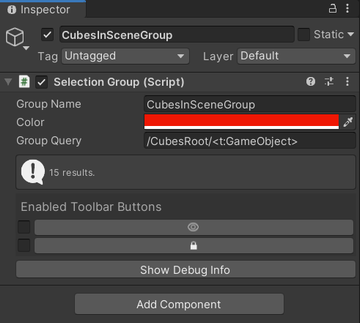

Selection Groups Overview
=============================

- [Introduction](#introduction)
  - [Getting Started](#getting-started)
- [Features](#features)

# Introduction

Selection Groups provides a more convenient workflow in Unity by 
allowing users to group a number of **GameObjects** under a common name.  
This way, we can do operations on these groups, 
instead of individual **GameObjects**.

Please refer to the [installation](installation.md) page to install Selection Groups package.

## Getting Started

1. Open the [Selection Groups window](selection-groups-window.md) via Window > General > Selection Groups.  
   We recommend to dock this window next to the Hierarchy window for easier member assignment.   

   

1. Click the `+` button and select "Create Empty Group". This will create a new item inside the window.

   
   
1. Drag some **GameObjects** from the hierarchy, or assets from the Project window. 
   
   

1. Click the group name, and the inspector window will display the following properties:

   

   |**Properties**       |**Description** |
   |:---                 |:---|
   | **Group name**      | identical to the name of the group **GameObject**.|
   | **Color**           | The color of the group shown in the [Selection Groups Window](selection-groups-window.md).|
   | **Group Query**     | Specifies a query which will automatically assign **GameObjects** from the hierarchy that match the query to the group.   See the [GoQL](goql.md) documentation for more information.|
   | **Toolbar Buttons** | Enables/disables the following toolbar items for the group in the [Selection Groups Window](selection-groups-window.md).   1. Eye: to show or hide all the **GameObjects** in the group.   2. Lock: to enable or disable the editing of all the **GameObjects** in the group.      |

   

# Features
1. [GoQL](goql.md)
2. [Project Settings](project-settings.md)
3. [Selection Groups Window](selection-groups-window.md)
