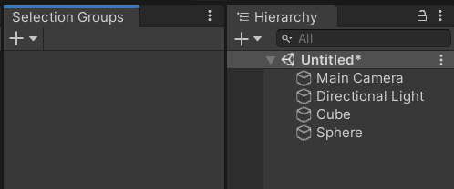

# Selection Groups User Documentation

## Overview

Selection Groups provides a more convenient workflow in Unity by 
allowing users to group a number of **GameObjects** under a common name.  
This way, we can do operations on these groups, 
instead of individual **GameObjects**.

Please refer to the [installation](installation.md) page to install Selection Groups package.

## Getting Started

1. Open the [Selection Groups window](selection-groups-window.md) via Window > General > Selection Groups.  
   We recommend to dock this window next to the Hierarchy window for easier member assignment.   

   

1. Click “Add Group” in the [Selection Groups window](selection-groups-window.md), and a new item will appear inside the window.   
1. Drag some **GameObjects** from the hierarchy, or assets from the Project window. 
   
   

1. Click the group name, and the inspector window will display the following properties:

   

   1. Group name 
   1. Group color
   1. GameObject Query  
      Specifies a query which will automatically assign **GameObjects** from the hierarchy
      that match the query to the group.  
      For example, `/Enemy*` will select all GameObjects that are in the root of the hierarchy 
      that have names starting with `Enemy`.  
      See the [GoQL](goql.md) documentation for more information.     
   1. Toolbar Buttons  
      Enables/disables the following toolbar items in the main Selection Groups window for the group.   
      1. Eye: to show or hide all the **GameObjects** in the group. 
      1. Lock: to enable or disable the editing of all the **GameObjects** in the group.  

      

