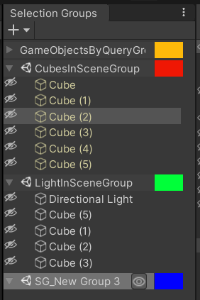
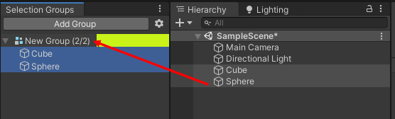
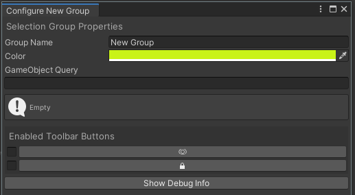
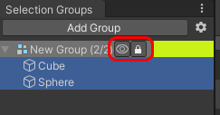

# Selection Groups User Documentation

## Overview

Selection Groups provides a more convenient workflow in Unity by 
allowing to group a number of **GameObjects** under a common name.
This way, we can do operations on these groups, 
instead of individual **GameObjects**.

## Getting Started

1. Open the selection group window via Window > General > Selection Groups.  
   We recommend to dock this window next to the Hierarchy window.   
   
1. Click “Add Group” in the Selection Groups window, and a new item will appear inside the window.   
1. Drag some **GameObjects** from the hierarchy, or assets from the Project window. 
   
1. Double click the group name, and a configuration dialog box will appear.   
   
   * We may change the group name and color.
   * The place for storing the data may be configured as well.
   * The [GameObject Query](goql.md) field allows us to specify a query 
     which will automatically select **GameObjects** from the hierarchy that match the query. 
     For example, `/Enemy*` will select all GameObjects that are in the root of the hierarchy 
     that have a name starting with `Enemy`. 
     See the [GoQL](goql.md) documentation for more information.
   * The Group Tools checkboxes enable toolbar items in the main Selection Groups window for each group. 
     These tools allow you to show and hide an entire group with a single click, 
     or enable and disable editing of an entire group with a single click.   
     

## Data Location

The data of each group can be stored in one of these two locations:
1. Scene: in a scene (default).  
   This allows scripts to access the data.
2. Editor: in an asset file outside scenes.  
   This allows a decoupling between the groups and the scenes, with a tradeoff 
   that the group data cannot be used by scripts.  
   The same group can be shared by multiple scenes, 
   but the Selection Group window will only show grouped **GameObjects** that exist in the opened scene.

> When the group data is stored in the Editor, the group saves references to **GameObjects** using 
> [GlobalObjectId API](https://docs.unity3d.com/ScriptReference/GlobalObjectId.html),
> which provides global identifiers for **GameObjects** in scenes, into an asset file.

