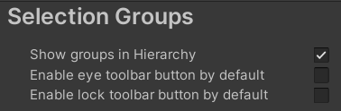

# Project Settings

The Selection Group item in [Project Settings](https://docs.unity3d.com/Manual/comp-ManagerGroup.html) 
is used to set the following settings:

|**Settings**              |**Description** |
|:---                      |:---|
| **Show groups in Hierarchy** | Show/hide group **GameObjects** in the hierarchy.|
| **Enable eye toolbar button by default**  | Enable eye toolbar item in the [Selection Groups Window](selection-groups-window.md) for newly created groups.|
| **Enable lock toolbar button by default** | Enable lock toolbar item in the [Selection Groups Window](selection-groups-window.md) for newly created groups.|

