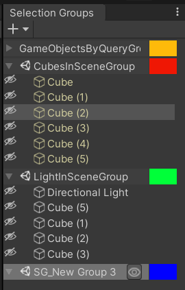

# The Selection Groups Window

The Selection Groups window shows all groups and their group members in the scene.    
We can do the following operations in the window.

|**Operations**          |**How** |
|:---                    |:---|
| **Creating a group**   | Click on the **Add Group** button. |
| **Deleting a group**   | Select a group and press the Delete key, or right click on the group and choose **Delete Group**. |
| **Changing a group order**   | Select a group and drag it to the desired order in the window. |
| **Adding group members**    | Drag **GameObjects** from the Hierarchy window, assets from the Project window, or members of other groups, into the applicable group.|
| **Moving group members**    | Select members of other groups, and drag them while pressing any Control key into the applicable group.|
| **Removing group members**  | Select the group members and press the Delete key, or right click on the group and choose **Remove From Group**.   To clear all members, right click on the group and choose "Clear Group".|
| **Selecting all group members**  | Double click on the group, or right click on the group and choose "Select All Group Members".   To select all members of all groups, go to **Edit > Select All**.|

We can also use the following key modifiers to maintain the current selection
when clicking on a group member.

|**Key**  |**Use** |
|:---     |:---|
| Ctrl | Add the group member into the current selection. |
| Ctrl+Shift | Add group members from the last selected member to the clicked member into the current selection.|

> **Groups with Query:**  
> The members of a group which has its **GameObject Query** 
> ([GoQL](https://github.com/Unity-Technologies/com.unity.selection-groups/blob/doc_window/Documentation~/goql.md)) 
> property set will be shown in yellow, 
> and both adding and removing members from this group are not allowed.  
