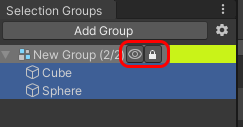

# SelectionGroups

# Overview

Selection groups allow a number of Unity Objects to be categorized under a common name.
The selection group data is initially stored in a scene which allows the data 
to be used by scripts.

As an alternative, the group data can instead be stored outside of the scene.
This allows a decoupling between the groups and the scenes, with a tradeoff 
that the group data cannot be used by scripts.

# Getting Started

1. Open the selection group window via Window > General > Selection Groups.  
   We recommend to dock this window next to the Hierarchy window.   
   
1. Click ÅgAdd GroupÅh in the Selection Groups window, and a new item will appear inside the window.   
1. Drag some **GameObjects** from the hierarchy, or assets from the Project window. 
   
1. Double click the group name, and a configuration dialog box will appear.   
   
   * We may change the group name and color.
   * The place for storing the data may be configured as well.
   * The [GameObject Query](Documentation~/goql.md) field allows us to specify a query 
     which will automatically select **GameObjects** from the hierarchy that match the query. 
     For example, `/Enemy*` will select all GameObjects that are in the root of the hierarchy 
     that have a name starting with `Enemy`. 
     See the [GoQL](Documentation~/goql.md) documentation for more information.
   * The Group Tools checkboxes enable toolbar items in the main Selection Groups window for each group. 
     These tools allow you to show and hide an entire group with a single click, 
     or enable and disable editing of an entire group with a single click.   
     

# How does storing the data outside a scene work ?

Unity has an [GlobalObjectId API](https://docs.unity3d.com/ScriptReference/GlobalObjectId.html) 
for creating a global identifier for objects in scenes. 
The Selection Group stores references to objects using this API, 
which is saved in an asset external to the project. 
This allows us to avoid modifying scenes when working with Selection Groups, and 
when a scene is loaded, the Selection Group window will only list **GameObjects** 
that currently exist in that scene.
